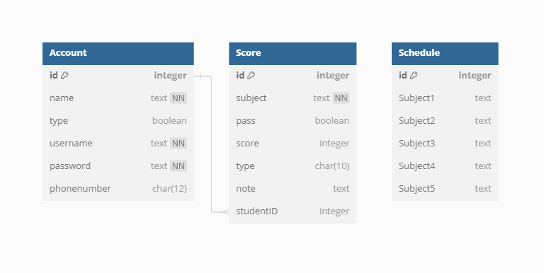
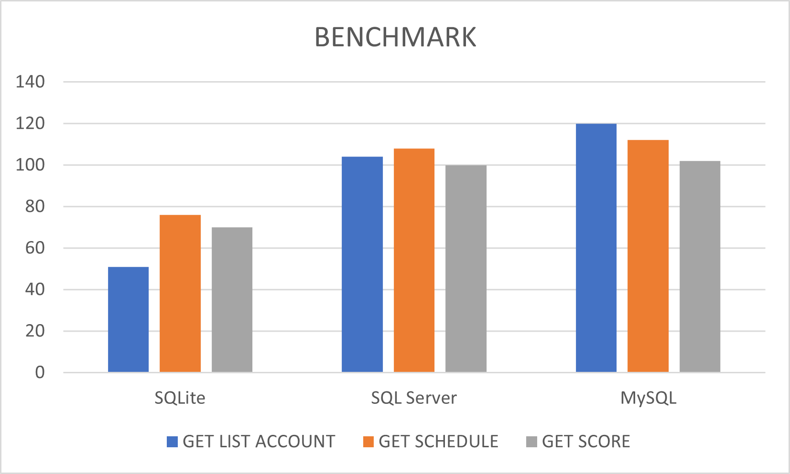

**BÁO CÁO ĐỒ ÁN: ỨNG DỤNG WINFORM KẾT HỢP REACT SỬ DỤNG WEBVIEW2**

### I. Giới thiệu

Sử dụng giữa WinForm và ReactJS, sử dụng WebView2 để tạo giao diện người dùng. Mục tiêu của dự án là cung cấp một trải nghiệm người dùng đẹp hơn, so với ứng dụng WinForm truyền thống. Các ưu điểm chính của dự án bao gồm giao tiếp thông qua API của WebView2 Winform - giao tiếp với Javascript thay vì đẩy dữ liệu lên GridView.

### II. Công nghệ sử dụng

1. **WinForm và React:**

   - WinForm được sử dụng để tạo giao diện cơ bản của ứng dụng.
   - React được tích hợp vào ứng dụng thông qua WebView2 để tạo giao diện người dùng đẹp hơn và tăng cường tính tương tác.

2. **WebView2:**

   - WebView2 được sử dụng để hiển thị nội dung ReactJS trong ứng dụng WinForm.
   - Giao tiếp thông qua API sẵn có của WebView2: [xem chi tiết tại đây!](https://learn.microsoft.com/en-us/microsoft-edge/webview2/reference/javascript/webview#properties)

3. **SQLite:**

   - SQLite được sử dụng để lưu trữ dữ liệu của ứng dụng,có thời gian thao tác nhanh hơn so với các hệ thống quản lý cơ sở dữ liệu phức tạp như MySQL, SQL Server...
     

### III. Ưu điểm của dự án

1. **Giao tiếp qua API:**

   - Thay vì đẩy dữ liệu lên GridView truyền thống, việc truy cập dữ liệu trực tiếp thông qua API giúp giảm bớt bước trung gian và tối ưu hóa hiệu suất truy cập dữ liệu :>(các ứng dụng quản lí bình thường load những tệp dữ liệu lớn khá là lag :>, muốn chạy nhanh thì phải tạo luồng mới để tạo data cho grid,gây phức tạp ứng dụng)

2. **Tốc độ load nhanh hơn:**

   - Sử dụng WebView2 và giao tiếp qua API giúp ứng dụng load nhanh hơn so với việc đẩy dữ liệu lên GridView trong WinForm truyền thống.
   - WebView2 cho phép tải nội dung web một cách nhanh chóng và hiệu quả.
     

3. **Phát triển theo đăng ký tài khoản phân quyền:**
   - Phát triển theo mô hình đăng ký tài khoản giáo viên và học sinh giúp quản lý người dùng và quyền hạn một cách dễ dàng và linh hoạt.
   - Điều này tăng tính bảo mật và linh hoạt cho ứng dụng.

### IV. Tổng kết
